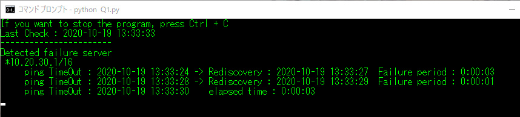

# Fixpoint_ProgrammingTest

## はじめに
この課題では，一定間隔で更新される監視ログファイルを対象とした処理が要求される．  
そのため本プログラムは常に実行し続け，定期的に監視ログファイルを読み込み処理を実行する．  
また，本プログラムの出力はコマンドプロンプト上に表示される．各課題において必要とされる情報のみ表示する．なお，異常が発生しているサーバアドレスには _*_ が頭につく.
### 課題
監視対象となる複数台のサーバに対して一定間隔でping応答確認が行われ，監視ログファイルに追記されている．  
このログファイルを読み込み，各サーバの状態を出力するプログラムを作成する．  
### 使用言語
Python3.8.3
### 実行環境
本プログラムはWindows上コマンドプロンプトから実行されることを想定し作成している．  
なお監視ログファイルはプログラムと同ディレクトリに生成されているものとする.  
### 監視ログファイルの命名定義と読み込み対象
監視ログファイルは，〇〇access.logというファイル名で存在する．  
〇〇には数値が入力される．これは監視開始の年月日が入ることを想定している．本プログラムはこの数値が最も大きいもの(=最新のデータ)を読み込み対象とする．  
今回は20201206access.logとし，このファイル内を書き換えることで本プログラムをテストする．
### テスト方法
監視ログファイルに一定間隔で情報が追記されていく状況を模擬した模擬プログラム _demo.py_ を用意した．  
模擬プログラムは，監視ログファイルの出力結果を模擬したsample〇.txtを読み込み，1秒毎に〇〇sample.txtの情報を上から順番に1行分だけ抽出し，〇〇access.logに追記していく．  
sample〇.txtの〇〇は数字が入っている．テストに利用するファイルは模擬プログラム実行時に選択可能にしている．
### プログラム停止方法
Windowsコマンドプロンプト上で _Ctrl + C_ を入力することで停止する．

## 設問1
監視ログファイルを読み込み，故障状態のサーバアドレスとそのサーバの故障期間を出力する．  
故障の判断はタイムアウトが発生した場合，故障期間は故障発生時からping応答があるまでの期間とする
### 仕様
故障発生後にping応答を確認できていない場合，定義上，故障期間が存在しない．そのため故障発生後からping応答がない場合は故障期間の表示はせず，現在も故障中という形で出力する．
### 出力
Windowsコンソール上に，現在までで読み込んだデータに基づいて，故障を検知したサーバーアドレスならびに故障発生時刻を表記する．  
故障を検知後，ping応答があった場合は経過時間をさらに表示する．  
故障を検知後，ping応答がない場合は，経過時間は表記されず，当該サーバアドレスの頭に _*_ を表記し，現在も応答がないことを示す．

### 内部表現
各サーバの状態をServerStateというリストで管理している．  
ServerStateは要素として[アドレス, 状態, 故障発生回数]の3つを持つ．  
状態は，状態未確認を-1, 通信不可を0, 通信可能状態を2と表現している．  
→ 通信可能状態を2と表したのは，のちの課題の過負荷状態を表現するために1を利用することを定めているため．
  
また，故障発生時刻，ping回復時刻を保存するため，FailedServerLogというリストに一連の情報を格納する．
FailedServerLogは要素として[アドレス, 時刻, ... ]を持つ．
時刻は，故障時刻とping回復時刻を組み合わせた文字列'YYYYMMDDhhmmssYYYYMMDDhhmmss'が対応する．故障時刻は前半14文字，ping回復時刻は後半14文字に相当する．pingが回復していない場合は後半14文字は存在しない．
