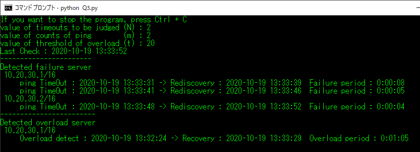
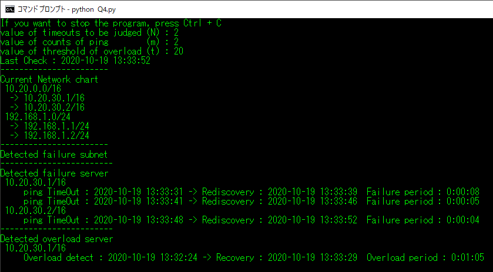

# Fixpoint_ProgrammingTest

## はじめに
この課題では，一定間隔で更新される監視ログファイルを対象とした処理が要求される．  
そのため本プログラムは常に実行し続け，定期的に監視ログファイルを読み込み処理を実行する．  
また，本プログラムの出力はコマンドプロンプト上に表示される．各課題において必要とされる情報のみ表示する．なお，異常が発生しているサーバアドレスには _*_ が頭につく.
### 課題
監視対象となる複数台のサーバに対して一定間隔でping応答確認が行われ，監視ログファイルに追記されている．  
このログファイルを読み込み，各サーバの状態を出力するプログラムを作成する．  
### 使用言語
Python3.8.3
### 実行環境
本プログラムはWindows上コマンドプロンプトから実行されることを想定し作成している．  
なお監視ログファイルはプログラムと同ディレクトリに生成されているものとする.  
### 監視ログファイルの命名定義と読み込み対象
監視ログファイルは，〇〇access.logというファイル名で存在する．  
〇〇には数値が入力される．これは監視開始の年月日が入ることを想定している．本プログラムはこの数値が最も大きいもの(=最新のデータ)を読み込み対象とする．  
今回は20201206access.logとし，このファイル内を書き換えることで本プログラムをテストする．
### テスト方法
監視ログファイルに一定間隔で情報が追記されていく状況を模擬した模擬プログラム _demo.py_ を用意した．  
模擬プログラムは，監視ログファイルの出力結果を模擬したsample〇.txtを読み込み，1秒毎に〇〇sample.txtの情報を上から順番に1行分だけ抽出し，〇〇access.logに追記していく．  
sample〇.txtの〇〇は数字が入っている．テストに利用するファイルは模擬プログラム実行時に選択可能にしている．
### プログラム停止方法
Windowsコマンドプロンプト上で _Ctrl + C_ を入力することで停止する．

## 設問1
監視ログファイルを読み込み，故障状態のサーバアドレスとそのサーバの故障期間を出力する．  
故障の判断はタイムアウトが発生した場合，故障期間は故障発生時からping応答があるまでの期間とする
### 仕様
該当プログラムは _Q1.py_  
故障発生後にping応答を確認できていない場合，定義上，故障期間が存在しない．そのため故障発生後からping応答がない場合は故障期間の表示はせず，現在も故障中という形で出力する．
### 出力
Windowsコンソール上に，現在までで読み込んだデータに基づいて，故障を検知したサーバーアドレスならびに故障発生時刻を表記する．  
故障を検知後，ping応答があった場合は経過時間をさらに表示する．  
故障を検知後，ping応答がない場合は，経過時間は表記されず，そのサーバアドレスの頭に _*_ を表記し，現在も応答がないことを示す．

### 変数表現
各サーバの状態をServerStateというリストで管理している．  
ServerStateは要素として[アドレス, 状態, 故障発生回数]の3つを持つ．  
状態は，状態未確認を-1, 通信不可を0, 通信可能状態を2と表現している．  
→ 通信可能状態を2と表したのは，のちの課題の過負荷状態を表現するために1を利用することを定めているため．
  
また，故障発生時刻，ping回復時刻を保存するため，FailedServerLogというリストに一連の情報を格納する．
FailedServerLogは要素として[アドレス, 時刻, ... ]を持つ．
時刻は，故障時刻とping回復時刻を組み合わせた文字列'YYYYMMDDhhmmssYYYYMMDDhhmmss'が対応する．故障時刻は前半14文字，ping回復時刻は後半14文字に相当する．pingが回復していない場合は後半14文字は存在しない．  
故障発生のたび，FailedServerLogリストには時刻の要素が追加されていく．
## 設問2
故障判断を， _N_ 回連続したタイムアウト時となるように拡張する．
### 仕様
該当プログラムは _Q2.py_  
 _Q2.py_ 実行時，最初に故障判断のためのタイムアウト回数 _N_ の入力を求められる．数値を入力し，Enterを入力すると状態監視が開始される．
  
### 出力
出力結果は設問1と同様である．
### 変数表現
設問1のリストServerStateを拡張し，要素として[アドレス, 状態, 故障発生回数, _タイムアウト回数_ ]の4つを持つようにした．  
タイムアウト回数が規定値Nを超えた時，故障発生回数がインクリメントされる．  
なお，故障発生時刻は故障と判断された時点でのサーバ状態確認日時としている．
その他の表現は設問1と同様である．

## 設問3
設問2のプログラムを拡張し，直近m回のping値の平均がtミリ秒w超えた時，そのサーバーが過負荷であるとし，過負荷状態となっている期間を出力する．
### 仕様
該当プログラムは _Q3.py_  
_Q3.py_ 実行時，最初に故障判断のためのタイムアウト回数 _N_ の入力，次にping値のサンプル数 _m_ の入力，最後に過負荷状態判断閾値である _t_ の入力が求められる．
故障時と同様，過負荷状態からの回復があるまでは過負荷状態となっている期間を定められない．そのため，過負荷状態であることを表すのみにとどめる．  
また，タイムアウト状態が発生した場合，故障と判断されていない場合はping値のサンプルとしては記録しない．  
加えて故障状態と判断された場合，記録されているping値はすべて消去され，故障状態から回復後の時点からのping値で状態判断が実施されるようにした．
### 出力
設問2までのプログラムを拡張し，過負荷状態となったサーバアドレス並びに過負荷発生時刻を表示する．  
過負荷から回復した場合，経過時間を出力する．
過負荷からの回復を確認できない場合，そのサーバアドレスの頭に _*_ を表記し，現在も過負荷状態であることを示す．

### 変数表現
設問2のリストServerStateをさらに拡張し，要素として[アドレス, 状態, 故障発生回数, タイムアウト回数, 平均ping値, 過負荷発生回数]の6つを持つようにした． 
このとき，ServerStateの状態として，過負荷時を1と表現する．
また，各サーバのping値サンプルを保持するため，ServerPingLogというリストを作成した．  
ServerPingLogの要素は[アドレス, ping値...]となっており，要素番号の小さい方から古いping値が格納されている．ただし，m回以上のping値サンプルは保持せず，古いサンプルから消去していく．サンプル数がm個となった時，平均応答時間が計測され，過負荷判断が行われる．  
過負荷であると判断された場合，判断された時刻と回復した時刻をOverloadServerLogというリストに格納する．  
リスト内の要素はFailedServerLogと同様である．
## 設問4
設問3までのプログラムを拡張し，サブネットの故障を判断する．
### 仕様
該当プログラムは _Q4.py_  
_Q3.py_ 実行時と同様，最初に故障判断のためのタイムアウト回数 _N_ の入力，次にping値のサンプル数 _m_ の入力，最後に過負荷状態判断閾値である _t_ の入力が求められる．
そのサブネット配下にあるサーバがすべて故障と判断された場合，サブネットの故障と判断する．故障時の取り扱いについては設問1の時と同様である．  
なお，サブネットが故障と判断されている最中，新たなサーバアドレスが登録され，かつping応答があると判断された場合はサブネットの故障が取り消される．
### 出力
まず現在の監視対象のサーバとサブネットの支配環境を図示する．この図上で，何かしらの異常が判断されたサーバにはサーバアドレスの頭に _*_ が表記される．  
その下に，故障判断が下されたサブネットをネットワークアドレスとして表記し，故障時刻と故障期間が表記される．表記の仕方については各サーバ米の故障時の取り扱いと同様である．

### 変数表現
新たにサブネットの状態を監視するSubnetStateというリストを作成した．  
SubnetStateは要素として[ネットワークアドレス, 状態，故障発生回数, 配下サーバ状態総和]を持つ．  
状態はServerState同様，未検出を-1, 故障を0, 正常を2と表現している．  
配下サーバ状態総和とは，配下にあるサーバの状態をすべて足し合わせたものである．配下にあるサーバの状態も故障は0であるため，配下のサーバがすべて故障と判断されているならば総和も0となり，サブネットが故障と判断できる．  
また，サブネットの故障ログを保持するため，FailedSubnetLog のリストを作成した．  
FailedSubnetLogも取り扱いはFailedServerLogやOverloadServerLogと同様である．
# 認識している現状の課題
各種プログラムにおけるFailedServerLog,OverloadServerLog, FailedSubnetLogはそれぞれ，無限大に拡大可能なリストとなっており，とりわけサーバの状態が不安定な環境であった場合は，膨大なデータを取り扱う場合メモリ使用量が問題となり得る．  
同様に，今回取り扱っているリストすべて，監視対象となるサーバアドレスをすべて保持しているため，監視対象が膨大となるとそれだけメモリ使用量が増大しかねない．  
これを解決するため，メモリ使用量を最小にするよう各種ログや監視中の情報をファイルとして書き出し，適宜必要な分だけ引き出すようにする必要があると考えている．　　
また，今回出力結果はコマンドプロンプト上でのみ確認可能で，結果をログには残していない．内部でどのような結果を演算し，結果を導いたのかを簡単には確認できないようになってしまっているため，のちのメンテナンスや調整を行いやすい構造づくりが必要と考える．
